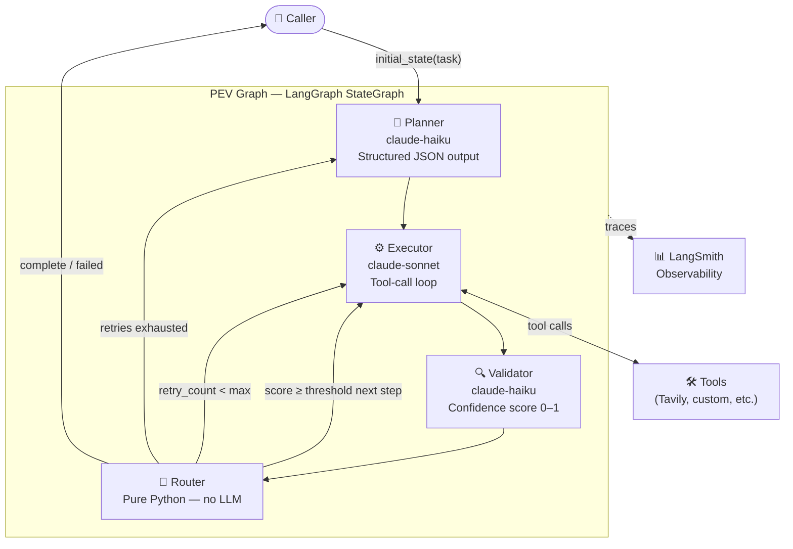
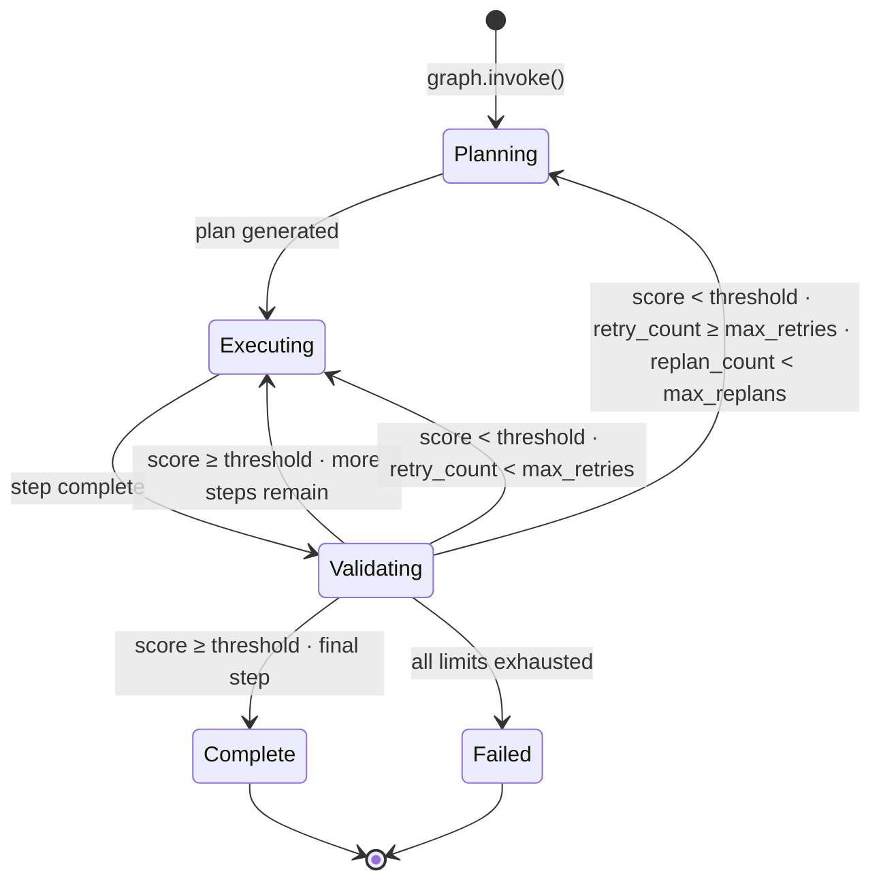
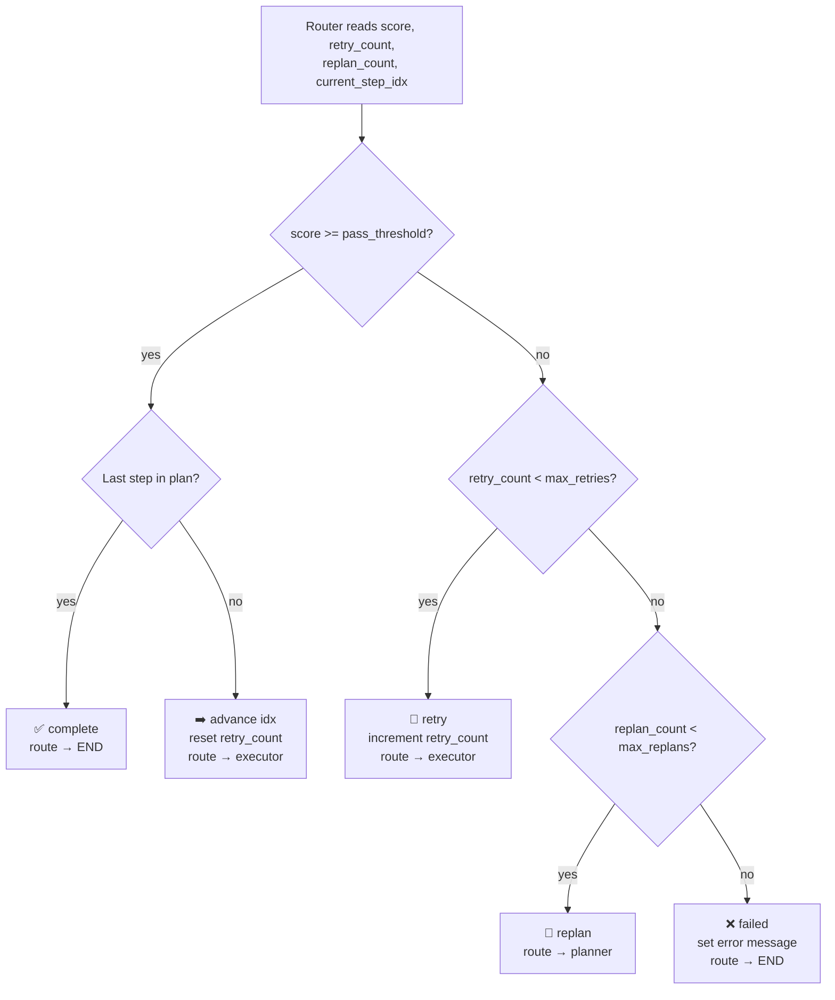
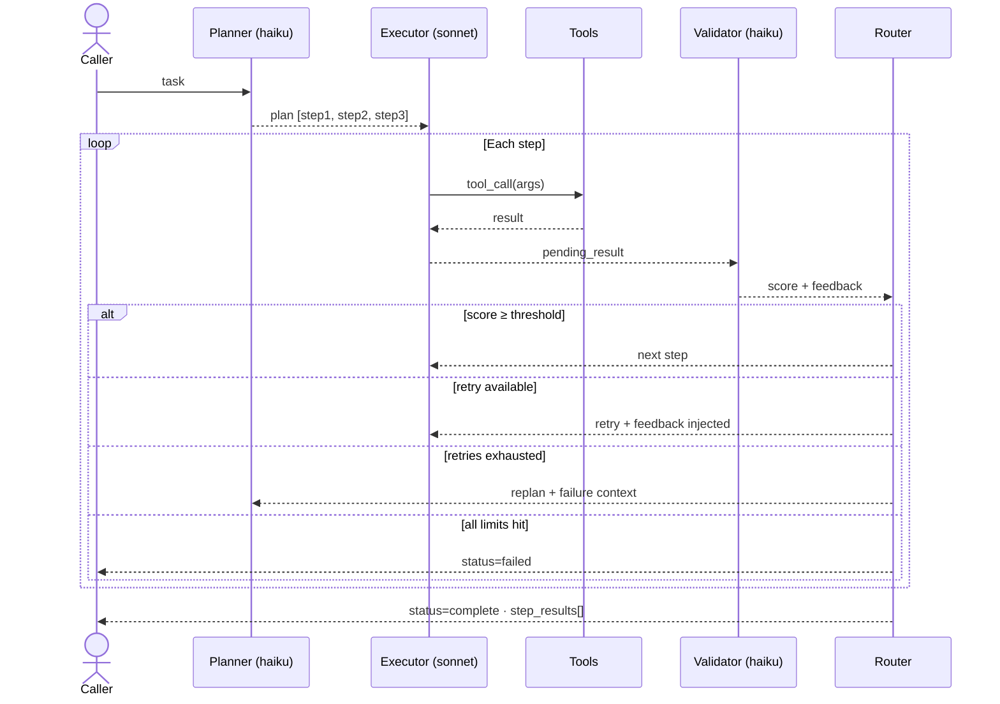
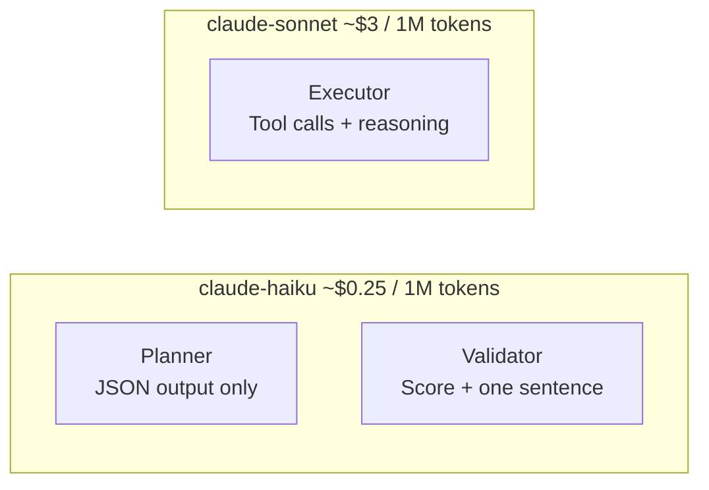

# langgraph-plan-execute-validate

> The missing third node in LangGraph plan-execute workflows — a structured Validator with confidence scoring, per-step retry, and automatic replanning.

[](https://github.com/ManjunathGovindaraju/langgraph-plan-execute-validate/actions/workflows/ci.yml)
[](https://codecov.io/gh/ManjunathGovindaraju/langgraph-plan-execute-validate)
[](https://www.python.org/downloads/)
[](https://github.com/langchain-ai/langgraph)
[](https://opensource.org/licenses/MIT)

---

## Why this template exists

I built and deployed **multi-agent platforms in production** inside a regulated life sciences environment — systems that automate scientific workflows, search tens of millions of research records, and route LLM decisions through quality gates before acting on them.

The standard LangGraph plan-and-execute pattern has two nodes: Plan and Execute. That's fine for demos. In production, we learned quickly that **execution quality is not binary** — an agent can technically complete a step while producing output that is incomplete, hallucinated, or missing a critical detail. Without a quality gate, those failures propagate silently to the next step.

We added a third node: a Validator that scores every step output (0.0–1.0) against the original intent. Steps below the threshold are retried with the validator's feedback injected into the next attempt. If retries are exhausted, the entire plan is regenerated with the failure context. Nothing moves forward until it passes.

This template packages that pattern. It is extracted from real production agent infrastructure, not assembled from documentation.

---

## What makes this different

| Feature | Standard plan-execute | **This template** |
|---|---|---|
| Planning node | ✓ | ✓ |
| Execution node with tool calls | ✓ | ✓ |
| Validation + confidence score | ✗ | **✓  0.0 – 1.0** |
| Per-step retry with feedback injection | ✗ | **✓  configurable** |
| Automatic replanning on exhausted retries | ✗ | **✓  with failure context** |
| Multi-model cost optimisation | ✗ | **✓  haiku/sonnet split** |
| Full audit trail (every attempt) | ✗ | **✓  operator.add accumulator** |
| Structured outputs (no string parsing) | ✗ | **✓  Pydantic models** |

---

## Quick Start

```bash
git clone https://github.com/ManjunathGovindaraju/langgraph-plan-execute-validate.git
cd langgraph-plan-execute-validate
uv sync
cp .env.example .env   # add your ANTHROPIC_API_KEY
```

**Five lines to run:**

```python
from pev import create_pev_graph, initial_state, PEVConfig

graph = create_pev_graph(PEVConfig(pass_threshold=0.85))
result = graph.invoke(initial_state("Research the top 3 vector databases"))

print(result["status"])          # "complete"
print(result["step_results"])    # scored audit trail for every step
```

**Run an example:**

```bash
python examples/research_agent.py       # web search + validate
python examples/code_review_agent.py    # strict threshold, shows retries
python examples/data_analysis_agent.py  # no tools, LLM reasoning only
```

---

## Architecture

### System Overview



### State Machine



### Router Decision Tree



### Request Lifecycle



---

## Configuration

```python
from pev import PEVConfig

cfg = PEVConfig(
    # Model routing — cheap models for bookkeeping, capable for execution
    planner_model   = "claude-haiku-4-5-20251001",   # structured JSON only
    executor_model  = "claude-sonnet-4-6",            # tool calls + reasoning
    validator_model = "claude-haiku-4-5-20251001",   # score + one sentence

    # Quality gate
    pass_threshold = 0.80,    # score ≥ this → step passes

    # Loop guards
    max_retries  = 2,         # retries per step before escalating to replan
    max_replans  = 1,         # full replanning cycles before marking failed

    # Tools available to the executor (planner and validator never see tools)
    tools = [TavilySearchResults(max_results=3)],
)
```

| Parameter | Default | Description |
|---|---|---|
| `planner_model` | `claude-haiku-4-5-20251001` | Model for planning — structured output only |
| `executor_model` | `claude-sonnet-4-6` | Model for execution — tool calls + reasoning |
| `validator_model` | `claude-haiku-4-5-20251001` | Model for validation — scoring only |
| `pass_threshold` | `0.80` | Minimum score [0.0–1.0] for a step to pass |
| `max_retries` | `2` | Retries per step before triggering replan |
| `max_replans` | `1` | Full replanning cycles before marking failed |
| `tools` | `[]` | LangChain tools available to the executor |

---

## The Audit Trail

Every attempt — including retries — is preserved in `step_results` via `operator.add`. Nothing is ever overwritten.

```python
result["step_results"]
# [
#   StepResult(step="Search for X",  score=0.55, attempts=1, feedback="Missing Y"),
#   StepResult(step="Search for X",  score=0.88, attempts=2, feedback="Good."),
#   StepResult(step="Summarise X",   score=0.92, attempts=1, feedback="Complete."),
# ]
```

This is the operational signal that matters: you can see exactly where the agent struggled, what feedback it received, and how many attempts each step took.

---

## Cost Model

The three-model design cuts per-run cost by ~60–70% vs routing everything through a capable model.



Typical cost for a 3-step task: **~$0.01** vs ~$0.027 if using sonnet throughout.

---

## Running Tests

```bash
# Unit tests — no API calls, runs in ~5 seconds
uv run pytest tests/ -m "not slow" -v

# Integration tests — requires ANTHROPIC_API_KEY
uv run pytest tests/ -m slow -v
```

Test coverage:

| File | What it tests |
|---|---|
| `test_planner.py` | First-plan vs replan, state resets, step injection |
| `test_executor.py` | Context injection, retry feedback, tool-call loop, unknown tools |
| `test_validator.py` | Score/feedback writing, score clamping, StepResult audit trail |
| `test_retry_replan.py` | Every router branch — 12 routing scenarios |
| `test_graph.py` | Config validation, graph compilation, `initial_state`, dispatch edge |

---

## Project Structure

```
langgraph-plan-execute-validate/
├── src/pev/
│   ├── __init__.py          # Public API: create_pev_graph, initial_state, PEVConfig, PEVState
│   ├── graph.py             # StateGraph wiring + router node + _dispatch edge
│   ├── state.py             # PEVState TypedDict, StepResult, Status
│   ├── config.py            # PEVConfig dataclass with validation
│   ├── prompts.py           # All prompt templates (one place, easy to tune)
│   └── nodes/
│       ├── planner.py       # Planner node — structured output, replan-aware
│       ├── executor.py      # Executor node — tool-call loop, context injection
│       └── validator.py     # Validator node — confidence scoring, audit append
├── examples/
│   ├── research_agent.py    # Tavily web search
│   ├── code_review_agent.py # Strict threshold, shows retry flow
│   └── data_analysis_agent.py # No tools, LLM reasoning only
├── tests/
│   ├── conftest.py          # Mock LLM fixtures, state builders
│   ├── test_planner.py
│   ├── test_executor.py
│   ├── test_validator.py
│   ├── test_retry_replan.py # Router decision tree — most critical tests
│   └── test_graph.py        # Compilation, config validation, dispatch
├── docs/
│   └── architecture.md      # Full architecture with 10 Mermaid diagrams
└── .github/workflows/
    └── ci.yml               # Ruff + pytest (unit only) + Codecov
```

---

## Extending

**Custom validator** — override the pass logic entirely:

```python
from pev.nodes.validator import make_validator_node
from pev.config import PEVConfig

# The validator prompt is in pev/prompts.py — edit VALIDATOR_SYSTEM to
# change scoring criteria without touching node logic.
```

**Custom tools** — any LangChain `BaseTool`:

```python
from langchain_core.tools import tool

@tool
def query_database(sql: str) -> str:
    """Execute a read-only SQL query."""
    ...

cfg = PEVConfig(tools=[query_database])
```

**Async execution:**

```python
result = await graph.ainvoke(initial_state("Your task"))
```

---

## Author

**Manjunath Govindaraju** — Principal Software Engineer with 23 years building production systems. Currently focused on AI platform engineering: multi-agent orchestration, MCP servers at scale, async data pipelines, and enterprise Kubernetes deployments.

[LinkedIn](https://www.linkedin.com/in/manjunathgovindaraju/) · [GitHub](https://github.com/ManjunathGovindaraju) · [fastmcp-production-template](https://github.com/ManjunathGovindaraju/fastmcp-production-template)

---

## License

MIT — use freely in production, no attribution required.
