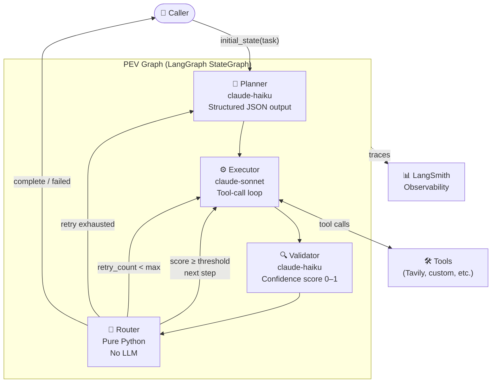
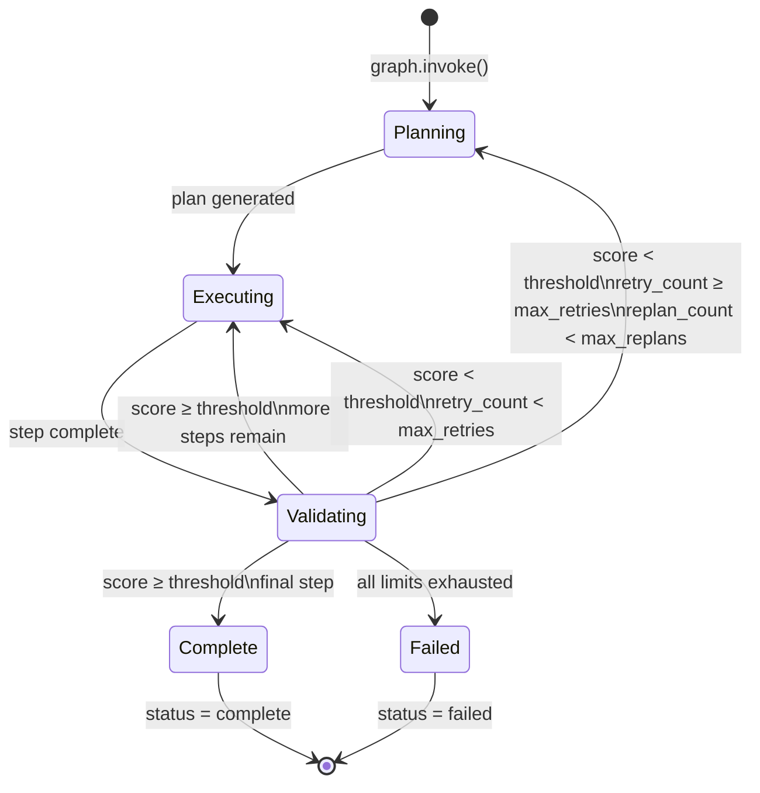
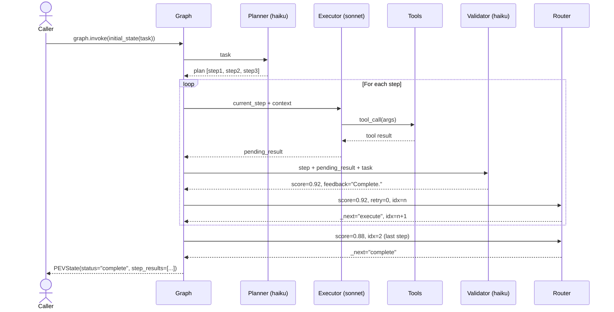
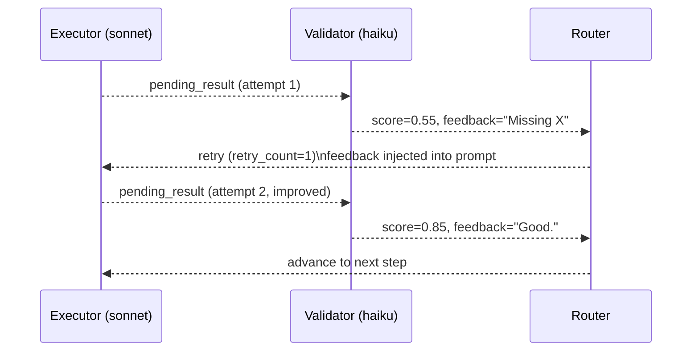
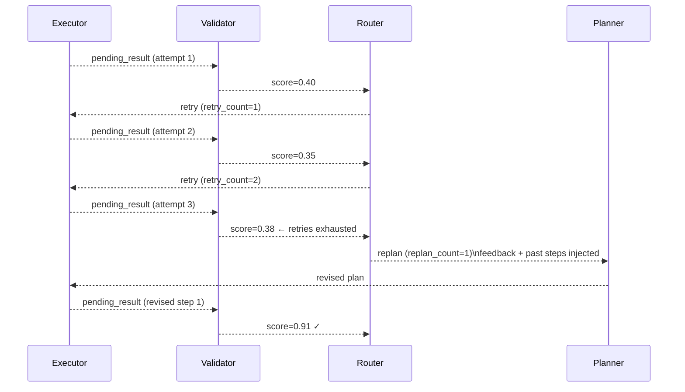
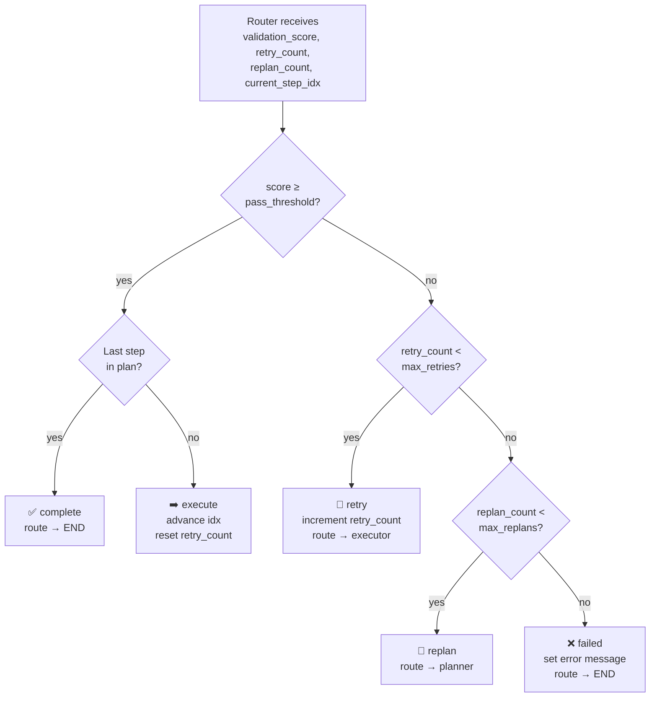
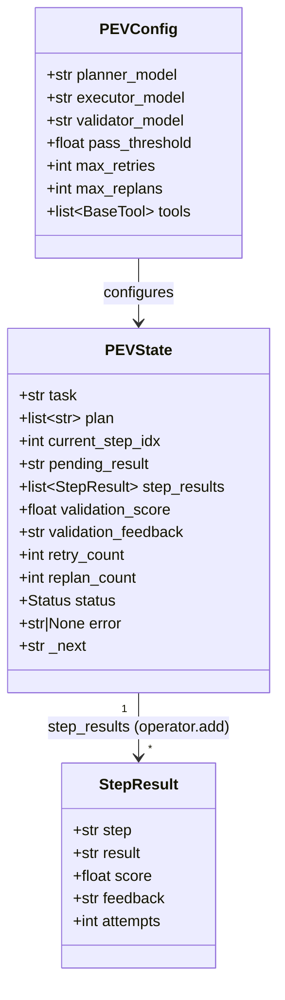
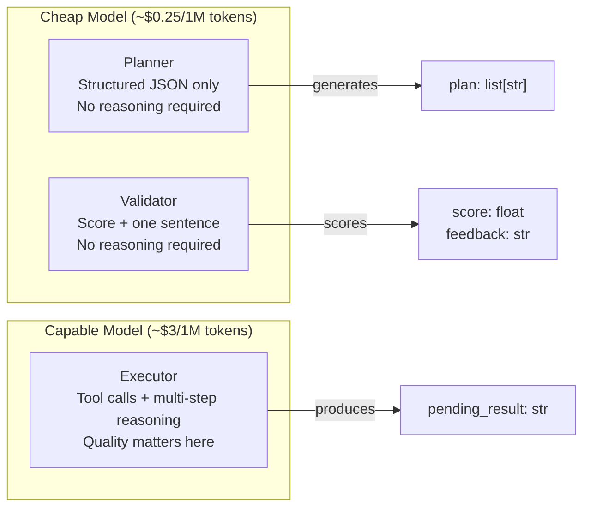
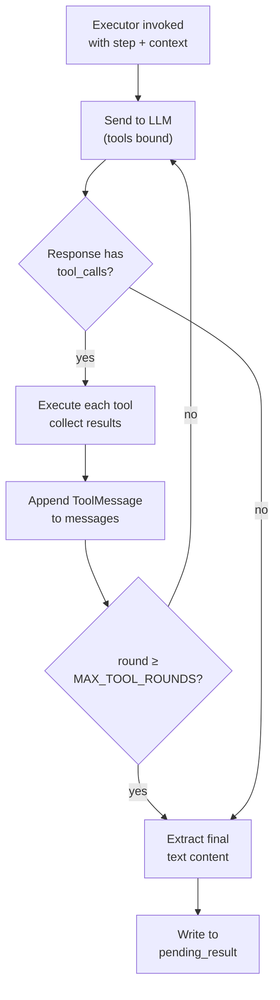

# Architecture: Plan → Execute → Validate

## Overview

The PEV graph extends the standard LangGraph plan-and-execute pattern with a
third node — a structured **Validator** — plus a **Router** that implements
deterministic retry and replanning logic. The result is an agent loop with
explicit quality gates and a full audit trail.

---

## 1. High-Level System Architecture



---

## 2. State Machine



---

## 3. Request Lifecycle — Happy Path



---

## 4. Retry Flow



---

## 5. Replan Flow



---

## 6. Router Decision Tree



---

## 7. State Schema



---

## 8. Cost Model — Why Three Models



The planner and validator only produce structured JSON — a cheap model
handles this perfectly. The executor is where reasoning and tool use happen;
investing in a capable model here drives the quality of the final output.

**Typical cost split per run (3-step task):**
- Planner: ~500 tokens × haiku rate = ~$0.0001
- Executor: ~3,000 tokens × sonnet rate = ~$0.009
- Validator: ~1,500 tokens × haiku rate = ~$0.0004
- **Total: ~$0.01 per run** vs ~$0.027 if using sonnet for all three

---

## 9. Tool-Call Loop (Executor)



The loop is capped at `MAX_TOOL_ROUNDS = 10` to prevent runaway agents.
Unknown tool names produce an error string (not an exception) so the LLM
can recover gracefully.

---

## 10. Audit Trail

Every execution attempt is preserved in `step_results` via `operator.add`.
This means retried steps produce multiple entries — full history, nothing
overwritten.

```
step_results = [
    StepResult(step="Search for X",  score=0.55, attempts=1, feedback="Missing Y"),
    StepResult(step="Search for X",  score=0.88, attempts=2, feedback="Good."),
    StepResult(step="Summarise X",   score=0.92, attempts=1, feedback="Complete."),
    StepResult(step="Write report",  score=0.95, attempts=1, feedback="Excellent."),
]
```

This audit trail is the core operational signal: you can see exactly where
the agent struggled, what feedback it received, and how many attempts each
step took.
